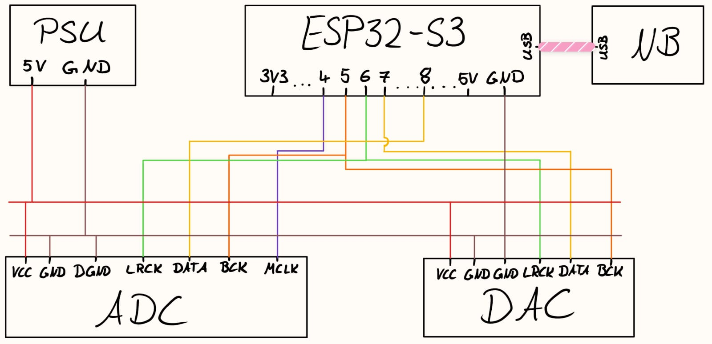

# Minefield

Minefield is a project for the ESP-32-S3.

A digital audio effect panel.

---

## WIRE Setup

## IRL Setup

---

The basic general idea is...

*Analog Audio Input* -> ADC -> *Digital Input* -> ESP-32 -> *Digital Output* -> DAC -> *Analog Audio* 

Work in Progress ... obviously 